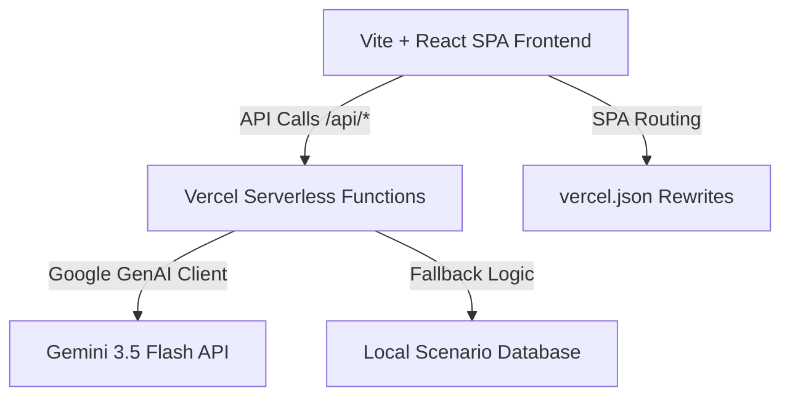

# Jigyasa AI

A localized, bilingual Socratic AI Inquiry Platform designed for K-12 students in India. Jigyasa AI moves education away from rote memorization and toward critical thinking, systems evaluation, and active reasoning.

---

## 📌 Problem Statement

Traditional K-12 education in India often prioritizes rote memorization over conceptual understanding and active reasoning. Although tools like ChatGPT have emerged, they typically provide students with direct answers, reinforcing passive learning. Additionally, there is a lack of:
- **Vernacular Accessibility**: Language barriers prevent millions of rural students from interacting with modern educational AI.
- **Localized Context**: Scenario examples are often Westernized rather than drawing from local environments (e.g., local governance, village water cycles, regional farming challenges).
- **Competency Tracking**: Standard tests evaluate memorization (recall) instead of systems thinking, adaptability, and critical reasoning.

---

## 💡 Solution

Jigyasa AI introduces a Socratic tutoring agent that guides students to discover solutions themselves through targeted, bilingual, age-appropriate questions. Key solutions include:
- **Vernacular Scenario Engine (VSE)**: Adapts curriculum topics into highly localized real-world challenges based on the student's Indian state (e.g., dry-bed desilting in Chennai, local Gram Panchayat budgeting) in multiple regional languages.
- **Socratic Dialogue & Devil's Advocate**: Acts as a Socratic coach, categorizing student responses (`RECALL`, `PARTIAL_REASONING`, `FULL_REASONING`) and providing opposing perspectives to push reasoning deeper.
- **Consequence Simulator**: Illustrates second-order impacts of student decisions across 1-week, 3-month, 1-year, and 5-year horizons, teaching systems thinking.
- **Skill Passport**: Evaluates student accomplishments across 8 core competencies (Critical Thinking, Adaptability, Adaptability, Innovation, etc.) rather than grading memorized facts.

---

## 🚀 Features

### 1. Student Journey
- **Baseline Assessment**: Calibrated MCQs, True/False, and Match-the-Following questions based on grade, subject, and state.
- **Personalized Inquiry Missions**: Formulates a custom mission goal and real-world task tailored to the student's baseline performance.
- **Interactive Socratic Chat**: Multimodal support allowing text answers, preset concept sketches/images, and voice recordings.
- **Devil's Advocate Challenge**: Simulates counter-arguments to push students to defend their ideas.
- **Consequence Timeline**: Animates positive, negative, and unexpected second-order consequences of their solutions.
- **Bilingual & Vernacular Support**: Native UI translations and model interaction in 11 Indian languages (Tamil, Hindi, Telugu, Kannada, Malayalam, Marathi, Gujarati, Bengali, Punjabi, Odia, English).

### 2. Teacher Dashboard
- **Attention List**: Flags students requiring intervention based on their reasoning level and engagement.
- **Competency Quizzes**: Bloom's Taxonomy-calibrated test generator (Knowledge, Application, Analysis).
- **Vernacular Parent Reports**: Generates narrative, competency-focused progress updates for parents.

### 3. Parent Dashboard
- **Active Skill Passports**: High-fidelity reports displaying child achievements, strongest skills, and growth suggestions.
- **Parent-Child Activities**: Actionable home-based discussion topics to bridge schoolwork and domestic engagement.

---

## 🏗️ Architecture

Jigyasa AI utilizes a Serverless Single Page Application (SPA) architecture optimized for zero-cold-start hosting on Vercel:



- **Frontend**: Vite + React, Lucide React icons, Tailwind CSS, Motion (Framer Motion) animation.
- **Backend**: Vercel Node.js Serverless Functions (`/api/*`), utilizing the `@google/genai` SDK for Gemini API integration.
- **State Management**: React State + React Router DOM.

---

## 🛠️ Tech Stack

- **Core UI**: React 19, TypeScript, Vite 6
- **Styling**: Vanilla CSS + Tailwind CSS 4
- **Routing**: React Router DOM 7
- **AI/LLM**: Google Gemini 3.5 Flash (`@google/genai` SDK)
- **Deployment**: Vercel Serverless Hosting
- **Internationalization**: i18next & react-i18next

---

## 📸 Screenshots

*Interactive screens for Student Portal, Socratic Probe, Devil's Advocate, Consequence Simulator, Teacher Console, and Skill Passport are accessible via the **Judge Demo Mode** menu on the top right.*

---

## 💻 Installation

1. **Clone the Repository**
   ```bash
   git clone https://github.com/<your-username>/jigyasa-ai.git
   cd jigyasa-ai
   ```

2. **Install Dependencies**
   ```bash
   npm install
   ```

3. **Configure Environment Variables**
   Create a `.env` or `.env.local` file in the root folder:
   ```env
   GEMINI_API_KEY=your_gemini_api_key_here
   ```

4. **Run Development Server**
   ```bash
   npm run dev
   ```
   Open `http://localhost:3000` in your browser.

---

## ☁️ Vercel Deployment

Deploying Jigyasa AI to Vercel takes less than 2 minutes:

1. **Via Vercel CLI (Recommended)**:
   ```bash
   npm install -g vercel
   vercel
   ```
   Follow the prompts to link your project. Add your `GEMINI_API_KEY` when prompted or in the Vercel dashboard.

2. **Via GitHub Integration**:
   - Push your code to a GitHub repository.
   - Import the repository into your Vercel Dashboard.
   - Set the environment variable `GEMINI_API_KEY` in Vercel under Project Settings -> Environment Variables.
   - Deploy!

---

## 👥 Team Members

* **Siva Sarathy** - Full Stack & Vercel Deployment Lead
* *Add other team members here...*

---

## 🏆 Hackathon Details

* **Hackathon**: Google AI Hackathon / AI Studio Build
* **Project Name**: Jigyasa AI
* **Track**: AI for Social Good / EdTech Innovation

---

## 🚀 Future Scope

1. **Multi-Agent Debates**: Allow students to debate against multiple AI agents playing different stakeholder roles (e.g. Village Sarpanch, Environmentalist, Business owner).
2. **Offline Mode**: A lightweight mobile client caching fallback questions and scenarios for rural areas with poor connectivity.
3. **Voice-to-Voice Socratic Coach**: Integrating real-time audio channels so students can converse naturally in their regional language without typing.
4. **School LMS Integrations**: Integrates directly with existing school systems like Diksha or standard LMS portals.
